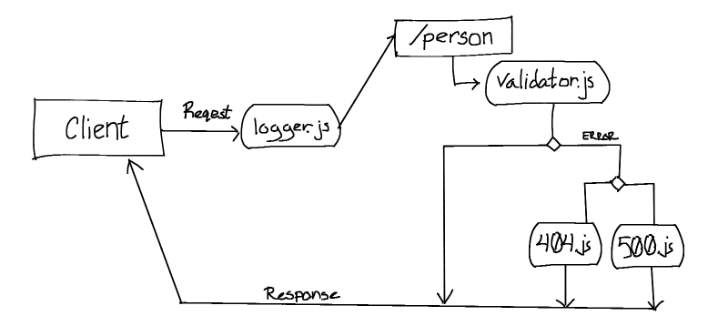

# Basic Express Server

A demonstration of an Express server with a single route and error handling.

Deployed Site: https://basic-express-server-project.herokuapp.com/ 
Latest Pull Request: https://github.com/Micha-L-Davis/basic-express-server/pull/1

## Installation

1. Clone this repository onto your local machine
2. `cd` into `./basic-express-server`
3. Install package dependencies with `npm install`

## Author

Micha Davis

## Routes

* GET : `/person?name=<USER NAME>`
    * Response:
        * 404 on a bad route
        * 500 if no name in the query string
        * 200 if the name is in the query string
